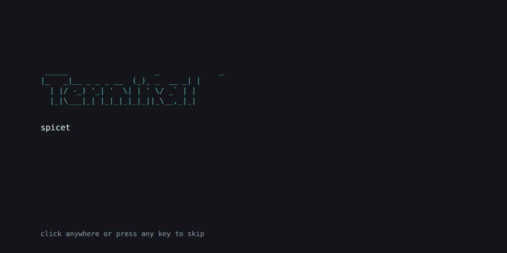
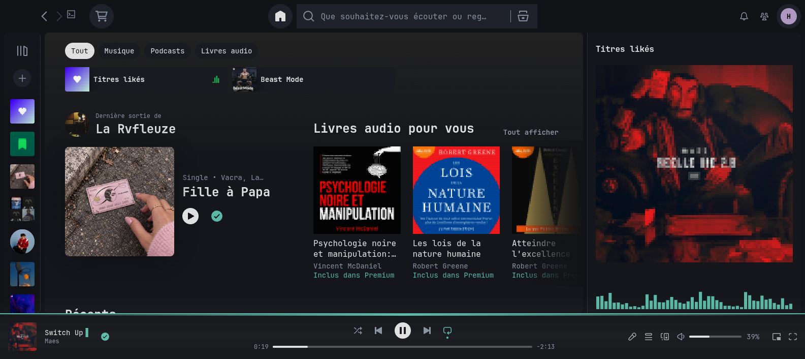
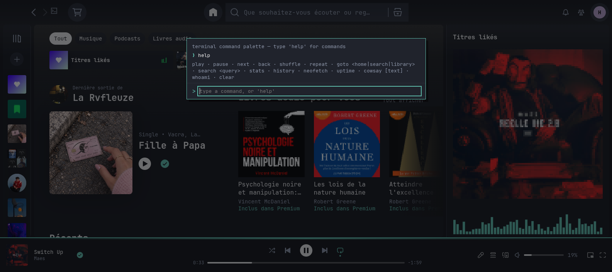
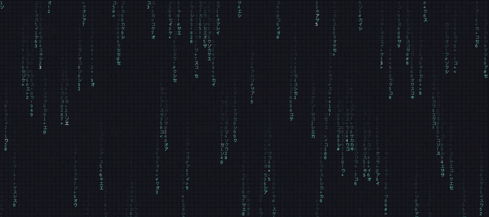

# Terminal

**A hacker/terminal Spicetify theme for Spotify desktop: a boot sequence, a shell-style command palette, live ASCII-art album covers, and matrix rain.**

[](LICENSE)
[](#works-on-linux-windows--macos)
[](https://github.com/spicetify/marketplace)
[](https://github.com/jesuisban22-code/spicetify-terminal/releases)



*The boot sequence shown when Spotify starts. This is a real capture of the theme's own `theme.js` and `user.css`.*

> Version française plus bas : [Français](#français).

Terminal is a [Spicetify](https://spicetify.app) theme for the Spotify desktop app with a hacker/terminal look: a dark background, monospace fonts everywhere, album covers turned into ASCII art as you browse, a matrix rain screensaver, and a command palette that works like a small shell.



## Works on Linux, Windows & macOS

- **Linux**: the reference platform. The theme was first built here.
- **Windows**: supported since v1.1.0. It detects the OS, falls back to Cascadia Mono or Consolas when JetBrains Mono isn't installed, keeps a drag strip so you can still move the window while an overlay is open, stays clear of the minimize/maximize/close buttons, and renders sharply at 125% / 150% / 4K scaling.
- **macOS**: supported. Install with the same bash commands as Linux (the config folder is `~/.config/spicetify`). Open the palette with `Cmd+Shift+K` (`Ctrl+Shift+K` works too). The window can still be dragged while the boot screen or the palette is open, nothing important sits under the traffic-light buttons, the font falls back to Menlo when JetBrains Mono isn't installed, and everything stays sharp on Retina displays.

See [CHANGELOG.md](CHANGELOG.md) for the full list of platform changes.

## Features

- **Boot sequence**: a terminal-style boot log when Spotify starts. Click or press any key to skip it.
- **Live ASCII-art covers**: album art is redrawn as ASCII on home, search, the library, playlist/album headers and the now-playing bar.
- **Command palette** (`Ctrl+Shift+K`, `Cmd+Shift+K` on macOS): a small shell for playback, navigation and stats, plus a few easter eggs ([command list](#command-palette)).
- **Audio visualizer** in the Now Playing view. It is driven by the track's real audio analysis (loudness envelope, timbre and pitch), not a generic loop.
- **Now-playing pulse** that follows the cover's dominant color and the track's real tempo.
- **Matrix rain screensaver**: it starts when Spotify is paused and you have been idle for a while. The delay (default 2 min) and speed can be changed.
- **CRT scanlines** overlay (optional).
- **Tempo markers** on the progress bar.
- **Vim-style keyboard navigation**: `j` / `k` move through track lists, `Enter` plays the selected track, `/` focuses search.
- **Themed mini-player** (Picture-in-Picture).
- **Settings panel**: turn any feature on or off from the theme's button in the top bar (`~/.terminalrc`).


*Matrix rain screensaver, captured from the theme's own canvas code.*

### Command palette

Open it with `Ctrl+Shift+K`, or `Cmd+Shift+K` on macOS (`Ctrl+Shift+K` works there too). The shortcut uses the physical K key, so it works on QWERTY, AZERTY and QWERTZ keyboards, and it doesn't fire on AltGr / Option. Press it again to close the palette. On Linux and Windows the Super / Windows key is not used, only `Ctrl`.

| Command | What it does |
|---|---|
| `help` | List the commands |
| `play` / `pause` | Resume or pause playback |
| `next` / `back` | Next or previous track |
| `shuffle` / `repeat` | Toggle shuffle, cycle through repeat modes |
| `goto <home\|search\|library>` | Go to a page |
| `search <query>` | Search Spotify |
| `stats` | Current track, artist, album, position, tempo, energy |
| `history` | Tracks played this session |
| `neofetch` | Session info in neofetch style (OS, Spotify version, uptime, enabled features…) |
| `uptime` | Session uptime and number of tracks played |
| `whoami` | Your Spotify display name |
| `cowsay [text]` | A cow says your text, or the current track if you leave it out |
| `clear` | Clear the palette output |

A few easter eggs are hidden in there too: `sudo`, `42`, `coffee`, `hack`, `matrix`… and `egg` lists them all.

## Screenshots

| Home | Command palette | Matrix rain |
|---|---|---|
|  |  |  |

## Installation

### From the Spicetify Marketplace (recommended)

1. Install the [Spicetify Marketplace](https://github.com/spicetify/marketplace) if you don't have it yet.
2. In Spotify, open the Marketplace, go to the **Themes** tab, search for **Terminal** and click **Install**.

### Manual install

**Linux / macOS** (bash, zsh; the config folder is `~/.config/spicetify` on both):

```bash
git clone https://github.com/jesuisban22-code/spicetify-terminal.git "$(spicetify -c | xargs dirname)/Themes/Terminal"
spicetify config current_theme Terminal color_scheme terminal
spicetify apply
```

**Windows** (PowerShell):

```powershell
git clone https://github.com/jesuisban22-code/spicetify-terminal.git "$(Split-Path (spicetify -c))\Themes\Terminal"
spicetify config current_theme Terminal color_scheme terminal
spicetify apply
```

On Windows the target folder is usually `%APPDATA%\spicetify\Themes\Terminal`.

To update a manual install, run `git pull` in that `Themes/Terminal` folder, then `spicetify apply`.

### Fonts

The theme uses the first monospace font it finds, in this order: **JetBrains Mono**, Fira Code, Hack, DejaVu Sans Mono, Cascadia Mono, Consolas, Menlo. For the intended look, install [JetBrains Mono](https://www.jetbrains.com/lp/mono/) on Linux, Windows or macOS (on macOS: `brew install --cask font-jetbrains-mono`, or download it). Without it, Windows falls back to Cascadia Mono (Windows 11 / Windows Terminal) or Consolas, and macOS to Menlo (built in), never Courier New.

## Requirements

- [Spicetify](https://spicetify.app) installed and working (`spicetify -v`)
- The theme injects JavaScript (`inject_theme_js = 1`, which `spicetify apply` turns on automatically with this theme)

## FAQ / Troubleshooting

**The colors changed but there's no boot sequence, palette or ASCII art.**
That means the theme's JavaScript isn't loaded. Turn JS injection on and apply again:

```bash
spicetify config inject_theme_js 1
spicetify apply
```

**The theme disappeared after a Spotify update.**
Spotify updates overwrite Spicetify's changes. Run:

```bash
spicetify restore backup apply
```

**Something looks broken or half-applied.**
Run `spicetify apply` again and restart Spotify. If that doesn't fix it, try `spicetify restore backup apply`.

**The font doesn't look like the screenshots.**
Install [JetBrains Mono](https://www.jetbrains.com/lp/mono/) and restart Spotify (see [Fonts](#fonts)).

**Can I turn off an effect (CRT scanlines, matrix rain, boot sequence…)?**
Yes. Click the theme's button in Spotify's top bar and uncheck it.

## Contributing

Found a bug or have an idea? [Open an issue](https://github.com/jesuisban22-code/spicetify-terminal/issues/new/choose). Please include your OS, Spotify version and `spicetify -v` output. Pull requests are welcome.

## License

[MIT](LICENSE)

---

## Français

**Un thème Spicetify hacker/terminal pour Spotify desktop : séquence de démarrage, palette de commandes façon shell, pochettes converties en art ASCII en direct et pluie matrix.**

Terminal est un thème [Spicetify](https://spicetify.app) pour l'application Spotify desktop, avec une esthétique hacker/terminal : fond sombre, police monospace partout, pochettes d'album converties en art ASCII en direct, pluie matrix en économiseur d'écran, et une vraie palette de commandes façon shell.

### Fonctionne sous Linux, Windows et macOS

- **Linux** : plateforme de référence, là où le thème a été conçu.
- **Windows** : pris en charge depuis la v1.1.0. Le thème détecte l'OS, se rabat sur Cascadia Mono ou Consolas si JetBrains Mono est absente, garde une bande de déplacement de la fenêtre pendant les overlays, ne cache pas les boutons réduire/agrandir/fermer, et reste net à 125 % / 150 % / 4K.
- **macOS** : pris en charge. Mêmes commandes bash que sous Linux (dossier de config `~/.config/spicetify`). La palette s'ouvre avec `Cmd+Shift+K` (`Ctrl+Shift+K` marche aussi). La fenêtre reste déplaçable pendant l'écran de démarrage et la palette, rien d'important n'est caché sous les boutons « feux tricolores », la police se rabat sur Menlo si JetBrains Mono est absente, et tout reste net sur écran Retina.

Détails dans le [CHANGELOG](CHANGELOG.md).

### Fonctionnalités

- **Séquence de démarrage** façon boot terminal au lancement de Spotify (clic ou touche pour passer)
- **Art de couverture ASCII** en direct sur les pochettes (accueil, recherche, bibliothèque, en-têtes de playlist/album, barre de lecture)
- **Palette de commandes** (`Ctrl+Shift+K`, `Cmd+Shift+K` sur macOS) : un vrai mini-shell (voir le tableau ci-dessous)
- **Visualiseur audio** dans la vue « En cours de lecture », piloté par les vraies données d'analyse audio du morceau (enveloppe de volume réelle, timbre et hauteur des notes), pas une animation générique
- **Pulsation « now playing »** synchronisée à la couleur dominante de la pochette et au tempo réel du morceau
- **Pluie matrix** en économiseur d'écran, quand la lecture est en pause et après un délai d'inactivité (2 min par défaut, délai et vitesse réglables)
- **Overlay CRT** (lignes de balayage) optionnel
- **Marqueurs de tempo** sur la barre de lecture
- **Navigation clavier façon vim** (`j`/`k` dans les listes, `Enter` pour lancer, `/` pour chercher)
- **Thème appliqué au mini-lecteur** (Picture-in-Picture)
- **Panneau de réglages** (bouton dans la barre du haut) : chaque effet s'active ou se désactive individuellement

#### Palette de commandes

`Ctrl+Shift+K`, ou `Cmd+Shift+K` sur macOS (où `Ctrl+Shift+K` marche aussi). Touche K physique : fonctionne en AZERTY, QWERTY et QWERTZ, pas déclenchée par AltGr / Option. Même raccourci pour refermer. Sous Linux et Windows, la touche Super / Windows n'est pas utilisée, seulement `Ctrl`.

| Commande | Effet |
|---|---|
| `help` | Liste des commandes |
| `play` / `pause` | Lecture / pause |
| `next` / `back` | Morceau suivant / précédent |
| `shuffle` / `repeat` | Aléatoire on/off, mode de répétition |
| `goto <home\|search\|library>` | Aller à une page |
| `search <requête>` | Rechercher dans Spotify |
| `stats` | Morceau, artiste, album, position, tempo, énergie |
| `history` | Morceaux joués pendant la session |
| `neofetch` | Infos de session façon neofetch |
| `uptime` | Durée de session et nombre de morceaux joués |
| `whoami` | Ton nom d'affichage Spotify |
| `cowsay [texte]` | Une vache dit ton texte (ou le morceau en cours) |
| `clear` | Efface la sortie |

Et quelques easter eggs : `sudo`, `42`, `coffee`, `hack`, `matrix`… `egg` les liste tous.

### Installation

#### Via le Spicetify Marketplace (recommandé)

1. Installe le [Spicetify Marketplace](https://github.com/spicetify/marketplace) si ce n'est pas déjà fait.
2. Ouvre le Marketplace dans Spotify, onglet **Themes**, cherche **Terminal**, clique **Install**.

#### Manuellement

Mêmes commandes que ci-dessus : bloc **bash** pour Linux / macOS (dossier de config `~/.config/spicetify` sur les deux), bloc **PowerShell** pour Windows (voir [Manual install](#manual-install)). Sur Windows, le dossier cible est en général `%APPDATA%\spicetify\Themes\Terminal`. Pour mettre à jour : `git pull` dans ce dossier, puis `spicetify apply`.

#### Polices

Le thème utilise la première police monospace disponible dans cet ordre : **JetBrains Mono**, Fira Code, Hack, DejaVu Sans Mono, Cascadia Mono, Consolas, Menlo. Pour le rendu de référence, installe [JetBrains Mono](https://www.jetbrains.com/lp/mono/) sur Linux, Windows ou macOS (sur macOS : `brew install --cask font-jetbrains-mono`, ou téléchargement direct). Sans elle, Windows utilise Cascadia Mono (Windows 11 / Windows Terminal) ou Consolas, et macOS Menlo (intégrée), jamais Courier New.

### Prérequis

- [Spicetify](https://spicetify.app) installé et fonctionnel (`spicetify -v`)
- Le thème injecte du JavaScript (`inject_theme_js = 1`, activé automatiquement par `spicetify apply` avec ce thème)

### FAQ / Dépannage

- **Les couleurs changent mais pas de séquence de démarrage, de palette ni d'ASCII** : le JavaScript du thème n'est pas chargé. Lance `spicetify config inject_theme_js 1` puis `spicetify apply`.
- **Le thème a disparu après une mise à jour de Spotify** : lance `spicetify restore backup apply`.
- **Rendu cassé ou partiel** : relance `spicetify apply` et redémarre Spotify. Sinon, `spicetify restore backup apply`.
- **La police ne ressemble pas aux captures** : installe JetBrains Mono et redémarre Spotify.
- **Désactiver un effet** (CRT, pluie matrix, démarrage…) : bouton du thème dans la barre du haut, puis décoche l'effet.

### Contribuer

Un bug ou une idée ? [Ouvre une issue](https://github.com/jesuisban22-code/spicetify-terminal/issues/new/choose) en précisant ton OS, ta version de Spotify et la sortie de `spicetify -v`. Les pull requests sont les bienvenues.

### Licence

[MIT](LICENSE)
